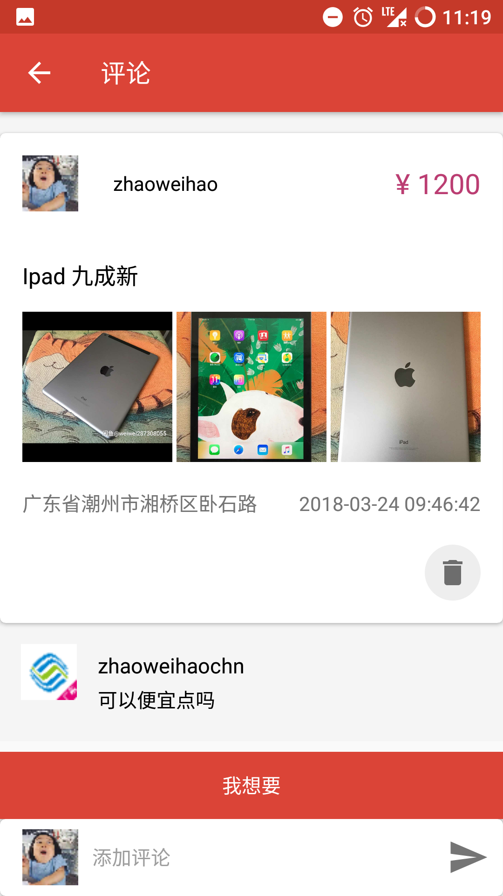
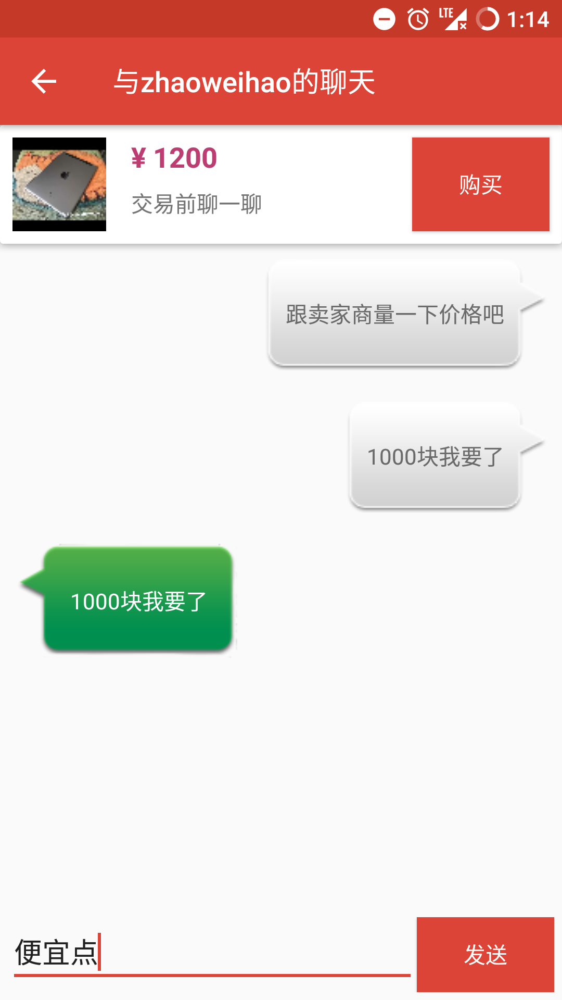
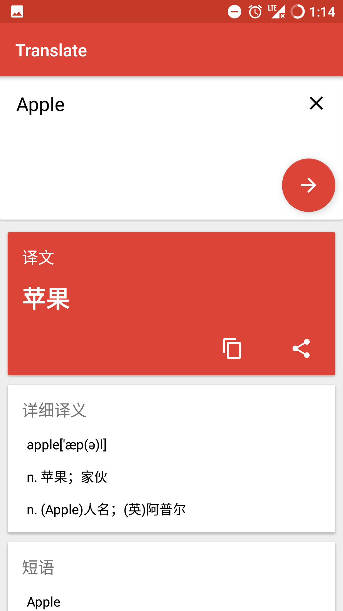

# Second-hand transactions

# 校园二手交易

## 总结

总结：这是我大半年前学校移动开发课的期末作业，一开始是做的校园社区APP，后来修改为校园二手交易，由于需求的变化和之前的水平比较水，当时又是刚开始学Kotlin就拿来用了，并且还没有学习架构，所以这个项目的整体结构比较混乱，代码比较难看🤢；但是还是留着做个纪念吧，毕竟这个APP也让我学习到了蛮多东西的，让我认识到写优秀代码的重要性，让我知道我有哪里的不足，同时也让我深度体验了一回Bmob后端云SDK的运用；在不会后端的前提下，运用后端云SDK蛮方便就是受制于SDK的功能性，SDK有提供就有没有就没有，这也是让我非常惆怅的。还是有闲的话自己搞后端比较好。推荐使用[Blade](https://github.com/lets-blade/blade)(Java)做简单的后端API，我上手了一下感觉很容易入门，非常适合我。好了～，要继续提升自己了。多看看别人优秀的代码后发现自己写的真的好水啊。。。

## 运行截图

|             主界面              |              公开评论界面               |              实时聊天界面               |              消息界面               |
| :-----------------------------: | :-------------------------------------: | :-------------------------------------: | :---------------------------------: |
|      |  |  |  |
|          **翻译功能**           |              **天气功能**               |             **云笔记功能**              |            **登录界面**             |
|  |          |      |      |

## 关于我

简要介绍：一个大三的有志小青年，梦想是改变世界(Change the world)，哈哈😄，梦想很伟大。从小事一点点做起吧，做个对社会有贡献的人就好了。

如何找到我：📮邮箱：zhaoweihao.dev@gmail.com（自从发现foxmail不能收到某些邮件我就果断改用gmail了）

状态：目前可以接受暑期实习，大概七月份左右可以实习，这段时间我会尽量提升自己，如果有大佬看上我，可以给我个机会，非常期待你的邮件。

附上简历📖：[简历](http://zhaoweihao.com/resume/xxx.pdf)

## 谢谢！